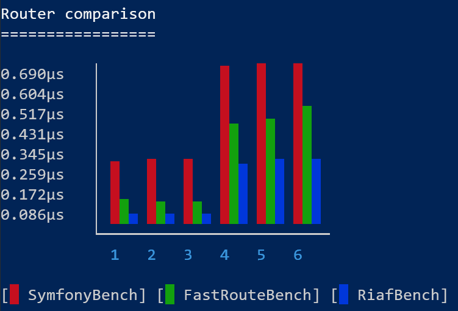

# Riaf-Router: (Likely) The fastest router

(You can find some more Routers benchmarked [here](Routers.md))

(Updated Results are [here](Results_2021-11-21.md))

## Motivation

I'm sure you'll ask yourself: Why? Why do we need another router? We have the symfony router for flexibility and fastroute for the speed. What's where to gain?

Last year we've started a project at my workplace -- let's call it Victoria -- that needed absolute, "no compromises" performance.
We evaluated Symfony, which was too slow. We evaluated other projects. But ultimately, we settled on Raw PHP. Nothing could beat the performance of that, for obvious reasons.


But I wasn't happy with that. The solution to performance shouldn't be to abandon all abstraction, get rid of all security.

And that's how [Riaf](https://github.com/L3tum/RiafCore) was born -- my own framework.

#### Disclaimer

Of course Routing is a very small part of any app, and premature optimization is the death to all software.
However, I'm a firm believer of trying to reduce any and all overhead (as humanly possible), as all these individual parts will add up.

If you want to take a look at the generated source code, you can find an [example Router here](images/Router.php).


## Performance

As you may already guess, Riaf is focused on Performance. The first part that I deeply optimized was the Router,
because that was the first thing we got rid of for Victoria. And it paid off.



### Symfony

````
| benchmark      | set                  | revs | its | mem_peak  | mode    |
+----------------+----------------------+------+-----+-----------+---------+
| SymfonyBench   | Static Best Case     | 1000 | 100 | 953.728kb | 0.264μs |
| SymfonyBench   | Static Average Case  | 1000 | 100 | 888.800kb | 0.280μs |
| SymfonyBench   | Static Worst Case    | 1000 | 100 | 888.800kb | 0.273μs |
| SymfonyBench   | Dynamic Best Case    | 1000 | 100 | 888.808kb | 0.674μs |
| SymfonyBench   | Dynamic Average Case | 1000 | 100 | 888.808kb | 0.680μs |
| SymfonyBench   | Dynamic Worst Case   | 1000 | 100 | 888.808kb | 0.686μs |
````

### FastRoute

````
| benchmark      | set                  | revs | its | mem_peak  | mode    |
+----------------+----------------------+------+-----+-----------+---------+
| FastRouteBench | Static Best Case     | 1000 | 100 | 888.808kb | 0.103μs |
| FastRouteBench | Static Average Case  | 1000 | 100 | 888.808kb | 0.092μs |
| FastRouteBench | Static Worst Case    | 1000 | 100 | 888.808kb | 0.092μs |
| FastRouteBench | Dynamic Best Case    | 1000 | 100 | 888.816kb | 0.419μs |
| FastRouteBench | Dynamic Average Case | 1000 | 100 | 888.816kb | 0.450μs |
| FastRouteBench | Dynamic Worst Case   | 1000 | 100 | 888.816kb | 0.507μs |
````

### RiafRouter

````
| benchmark      | set                  | revs | its | mem_peak  | mode    |
+----------------+----------------------+------+-----+-----------+---------+
| RiafBench      | Static Best Case     | 1000 | 100 | 888.800kb | 0.043μs |
| RiafBench      | Static Average Case  | 1000 | 100 | 888.800kb | 0.044μs |
| RiafBench      | Static Worst Case    | 1000 | 100 | 888.800kb | 0.043μs |
| RiafBench      | Dynamic Best Case    | 1000 | 100 | 888.808kb | 0.260μs |
| RiafBench      | Dynamic Average Case | 1000 | 100 | 888.808kb | 0.277μs |
| RiafBench      | Dynamic Worst Case   | 1000 | 100 | 888.808kb | 0.275μs |
````

## What? How?

We all remember [Nikita's blog post](https://www.npopov.com/2014/02/18/Fast-request-routing-using-regular-expressions.html)
on FastRoute and why it's fast. In essence, the "routing problem" can be summarized as follows (from fastest to slowest):
- Runtime Lookup in Table, but doesn't support parameterized routes
- Pre-Compiled if/else chain supports dynamic routes, but needs pre-compilation
- Iterating through a table and matching the individual parts is the most flexible

FastRoute took this problem to the next level and merged the first and last into "optimized iterating through a table":
- Runtime Lookup in Table
- Pre-Compiled if/else chain 
- Optimized iterating through a table
- Iterating through a table and matching the individual parts

I'll be honest, it took me a good hour to even understand it, and another hour to understand why it's so fast...but...

Now there's a new player: ``match``.
What's so special about match, you ask?

````
| benchmark               | subject          | revs  | its | mem_peak  | mode    |
+-------------------------+------------------+-------+-----+-----------+---------+
| StaticRouteChooserBench | benchIfElse      | 10000 | 100 | 888.368kb | 0.059μs |
| StaticRouteChooserBench | benchIsset       | 10000 | 100 | 888.464kb | 0.042μs |
| StaticRouteChooserBench | benchMatch       | 10000 | 100 | 888.368kb | 0.023μs |
| StaticRouteChooserBench | benchNestedMatch | 10000 | 100 | 888.416kb | 0.024μs |
````

As you can see, it offers double the performance of a pre-compiled if/else chain. But that's not the end of it,
if you look closely, you'll see that a nested match is still significantly faster and only requires 0,02microseconds of additional processing time.

#### Why is it faster than FastRoute's static route matching then? That's just doing an isset call!

You're right, why *is* match faster than `isset`? That comes down to a simple problem: `isset` needs an `if`:
- `isset($routingTable[$route]) ? $routingTable[$route] : null` 
- `$routingTable[$route] ?? null`.

Well, ``match`` doesn't require an `if`. It's its own `if`! As such it's even faster than a table lookup, while offering more flexibility, e.g. calling a method or nesting matches.
(I'm sure the exact reasons `match` is faster are way more complex and can't be summed up by such a simple statement.)
(The whole reason may also simply be that FastRoute creates an Array for its response, while Riaf does not...)

Therefore, a new level was created:
- Pre-Compiled match chain
- Runtime Lookup in Table,
- Pre-Compiled if/else chain
- Optimized iterating through a table
- Iterating through a table and matching the individual parts

## Scaling

Another upside of `match` is that it scales *really well* with the number of routes. 
The benchmarks above are with 10 Routes and while I agree that apps with many more are very very very rare, it's still fun to see the theoretical scaling.
Below are the best/worst cases of each router, for both static and dynamic routes, with varying number of routes.


### Static Routes (10)
````
| benchmark      | set                  | revs | its | mem_peak  | mode    |
+----------------+----------------------+------+-----+-----------+---------+
| SymfonyBench   | Static Best Case     | 1000 | 100 | 953.728kb | 0.264μs |
| SymfonyBench   | Static Worst Case    | 1000 | 100 | 888.800kb | 0.273μs |
| FastRouteBench | Static Best Case     | 1000 | 100 | 888.808kb | 0.103μs |
| FastRouteBench | Static Worst Case    | 1000 | 100 | 888.808kb | 0.092μs |
| RiafBench      | Static Best Case     | 1000 | 100 | 888.800kb | 0.043μs |
| RiafBench      | Static Worst Case    | 1000 | 100 | 888.800kb | 0.043μs |
````

### Dynamic Routes (10)
````
| benchmark      | set                  | revs | its | mem_peak  | mode    |
+----------------+----------------------+------+-----+-----------+---------+
| SymfonyBench   | Dynamic Best Case    | 1000 | 100 | 888.808kb | 0.674μs |
| SymfonyBench   | Dynamic Worst Case   | 1000 | 100 | 888.808kb | 0.686μs |
| FastRouteBench | Dynamic Best Case    | 1000 | 100 | 888.816kb | 0.419μs |
| FastRouteBench | Dynamic Worst Case   | 1000 | 100 | 888.816kb | 0.507μs |
| RiafBench      | Dynamic Best Case    | 1000 | 100 | 888.808kb | 0.260μs |
| RiafBench      | Dynamic Worst Case   | 1000 | 100 | 888.808kb | 0.275μs |
````

### Static Routes (100)
````
| benchmark      | set                  | revs | its | mem_peak  | mode    |
+----------------+----------------------+------+-----+-----------+---------+
| SymfonyBench   | Static Best Case     | 1000 | 100 | 1.608mb   | 0.271μs |
| SymfonyBench   | Static Worst Case    | 1000 | 100 | 1.097mb   | 0.277μs |
| FastRouteBench | Static Best Case     | 1000 | 100 | 888.808kb | 0.107μs |
| FastRouteBench | Static Worst Case    | 1000 | 100 | 888.816kb | 0.095μs |
| RiafBench      | Static Best Case     | 1000 | 100 | 1.889mb   | 0.043μs |
| RiafBench      | Static Worst Case    | 1000 | 100 | 1.889mb   | 0.043μs |
````

### Dynamic Routes (100)
````
| benchmark      | set                  | revs | its | mem_peak  | mode    |
+----------------+----------------------+------+-----+-----------+---------+
| SymfonyBench   | Dynamic Best Case    | 1000 | 100 | 1.097mb   | 0.823μs |
| SymfonyBench   | Dynamic Worst Case   | 1000 | 100 | 1.097mb   | 0.869μs |
| FastRouteBench | Dynamic Best Case    | 1000 | 100 | 888.816kb | 0.434μs |
| FastRouteBench | Dynamic Worst Case   | 1000 | 100 | 888.824kb | 1.597μs |
| RiafBench      | Dynamic Best Case    | 1000 | 100 | 1.889mb   | 0.264μs |
| RiafBench      | Dynamic Worst Case   | 1000 | 100 | 1.889mb   | 0.280μs |
````

### Static Routes (1000)
````
| benchmark      | set                  | revs | its | mem_peak  | mode    |
+----------------+----------------------+------+-----+-----------+---------+
| SymfonyBench   | Static Best Case     | 1000 | 100 | 6.249mb   | 0.273μs |
| SymfonyBench   | Static Worst Case    | 1000 | 100 | 6.249mb   | 0.278μs |
| FastRouteBench | Static Best Case     | 1000 | 100 | 2.350mb   | 0.106μs |
| FastRouteBench | Static Worst Case    | 1000 | 100 | 2.350mb   | 0.093μs |
| RiafBench      | Static Best Case     | 1000 | 100 | 14.607mb  | 0.044μs |
| RiafBench      | Static Worst Case    | 1000 | 100 | 14.607mb  | 0.045μs |
````

### Dynamic Routes (1000)
````
| benchmark      | set                  | revs | its | mem_peak  | mode     |
+----------------+----------------------+------+-----+-----------+----------+
| SymfonyBench   | Dynamic Best Case    | 1000 | 100 | 6.249mb   | 2.517μs  |
| SymfonyBench   | Dynamic Worst Case   | 1000 | 100 | 6.249mb   | 2.700μs  |
| FastRouteBench | Dynamic Best Case    | 1000 | 100 | 2.350mb   | 0.427μs  |
| FastRouteBench | Dynamic Worst Case   | 1000 | 100 | 2.350mb   | 13.860μs |
| RiafBench      | Dynamic Best Case    | 1000 | 100 | 14.607mb  | 0.275μs  |
| RiafBench      | Dynamic Worst Case   | 1000 | 100 | 14.607mb  | 0.296μs  |
````

## Drawbacks

Contrary to other routers that claimed to be "faster than FastRoute", Riaf does still support routing based on HTTP-Method.
Lots of routers had that drawback, as it's an easy optimization. But that leads to significant problems.
The standard REST Routing like ``GET /user/{id}`` and `DELETE /user/{id}` would not be easily possible. 

It also does not `trim` the routes to avoid comparisons. Instead it matches routes exactly, as is the correct behaviour.

However, even Riaf has some drawbacks. Right now, it's not possible to use closures or runtime-added routes in Riaf.
Additionally, it consumes *much* higher memory depending on the number of routes (especially at 1000 routes).
My best guess is that it doesn't play nice with string interning. I am working on fixes for both, obviously.

## Further Steps

As always, there's still some stuff left to do. One obvious thing is to deduplicate common prefixes in order to speed up matching and reduce memory usage.
