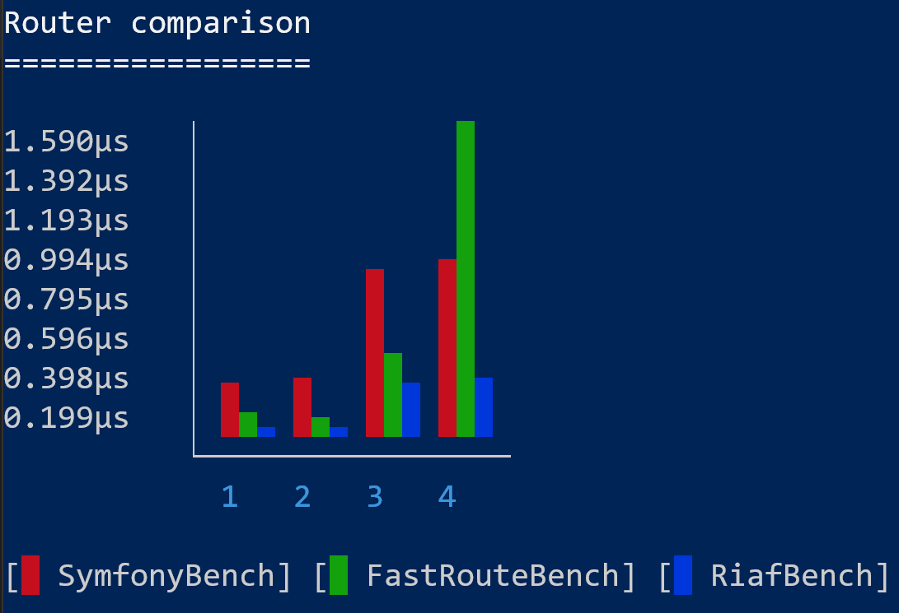

### Symfony

````
| benchmark      | set                  | revs | its | mem_peak  | mode    |
+----------------+----------------------+------+-----+-----------+---------+
| SymfonyBench   | Static Best Case     | 1000 | 100 | 1.601mb   | 0.269μs |
| SymfonyBench   | Static Worst Case    | 1000 | 100 | 1.095mb   | 0.283μs |
| SymfonyBench   | Dynamic Best Case    | 1000 | 100 | 1.095mb   | 0.833μs |
| SymfonyBench   | Dynamic Worst Case   | 1000 | 100 | 1.096mb   | 0.874μs |
````

### FastRoute

````
| benchmark      | set                  | revs | its | mem_peak  | mode    |
+----------------+----------------------+------+-----+-----------+---------+
| FastRouteBench | Static Best Case     | 1000 | 100 | 885.136kb | 0.102μs |
| FastRouteBench | Static Worst Case    | 1000 | 100 | 885.144kb | 0.097μs |
| FastRouteBench | Dynamic Best Case    | 1000 | 100 | 885.144kb | 0.407μs |
| FastRouteBench | Dynamic Worst Case   | 1000 | 100 | 885.152kb | 1.590μs |
````

### RiafRouter

````
| benchmark      | set                  | revs | its | mem_peak  | mode    |
+----------------+----------------------+------+-----+-----------+---------+
| RiafBench      | Static Best Case     | 1000 | 100 | 1.331mb   | 0.049μs |
| RiafBench      | Static Worst Case    | 1000 | 100 | 1.331mb   | 0.049μs |
| RiafBench      | Dynamic Best Case    | 1000 | 100 | 1.331mb   | 0.271μs |
| RiafBench      | Dynamic Worst Case   | 1000 | 100 | 1.331mb   | 0.283μs |
````
